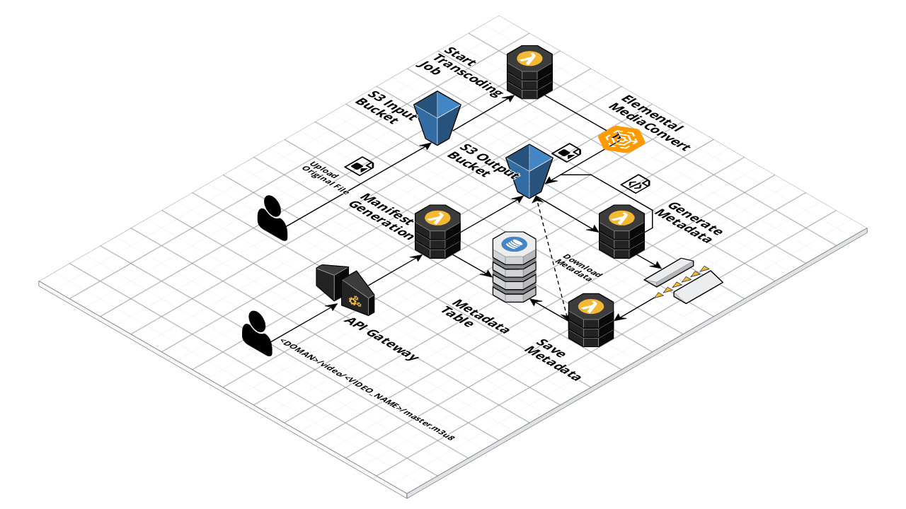

# Serverless Manifest Service

This repo is based on an example written by [@bahern](https://github.com/bahern).

## Overview
Simple video transcoding pipeline and streaming service build on top of Kolin, Spring boot, AWS Lambda, Elemental MediaConvert, API Gateway, and more.



## Requirements
- Serverless Framework
- Java 11
- [Native HLS](https://addons.mozilla.org/en-US/firefox/addon/native_hls_playback/), If using Firefox or Chrome.
  
## Setup

### Create the Elastic Transcoder pipeline
This setup has a single manual step, create the Elastic Transcoder pipeline, once created, take note of the `pipeline-id`.

### Compile project 
Using the gradle task `shadowJar` compile and create the packages
```bash
./gradlew shadowJar
```

### Deploy the CloudFormation stack
```bash
serverless deploy
```
### Update the Elastic Transcoder pipeline buckets
Update the Elastic Transcoder input and output buckets with the values of the CloudFormation outputs `InputBucketName` 
and `OutputBucketName`

## How to use

1. Upload a video file e.g. `example.mp4` to the input bucket.
1. MediaConvert will produce a `.ts`, `.m3u8`, and a couple `.json` files for the following renditions:
   - `480x270`
   - `640x360`
   - `960x540`
   - `1280x720`
   - `1920x1080`
   - `1600x1200`
   
1. Once these files have been created, visit the API Gateway endpoint in Safari (or using the [Native HLS](https://addons.mozilla.org/en-US/firefox/addon/native_hls_playback/)) plugin:
```
https://<ID>.execute-api.us-<REGION>.amazonaws.com/<STAGE>/video/example/master.m3u8
```
